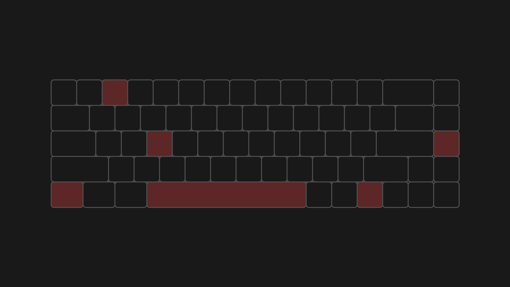

# Input System

## About

This is a robust input system for android. I used in many desktop program I developped using processing. It allows you a sensible way to check an input anywhere you want in the draw loop of the program. To use it is very easy, since it's a single class, there are a couple things you need to invoke after that, the main should look like: 

```processing

int WIDTH, HEIGHT;
Input input;

void setup() {
    size(600, 400);
    WIDTH = width;
    HEIGHT = height;
    input = new Input();
}

void draw() {
    input.earlyUpdate();

    input.lateUpdate();
}

void mousePressed() {
  input.mousePressedUpdate();
}

void mouseReleased() {
  input.mouseReleasedUpdate();
}

void keyPressed() {
  input.keyPressedUpdate();
}

void keyReleased() {
  input.keyReleasedUpdate();
}

void mouseWheel(MouseEvent e) {
  input.mouseWheelUpdate(e);
}
```



## Usage

To run this project, you have a couple ways, the first and easiest way is to install the Processing IDE, open it and run it.

If you want a cleaner way, I'd recommend installing **processing-java**. If you do that you can then just do:

```
make
```

## Installation

**I do not recommend to install this project**, but you still have the option.

```
make build
sudo make install
make clean
```

## Licence

This project is licenced under the GPLv3 licence.
For more information, read the license file.
